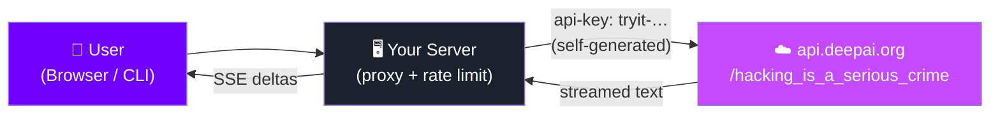
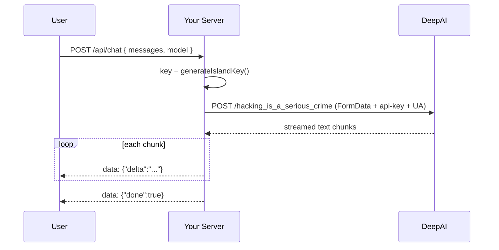
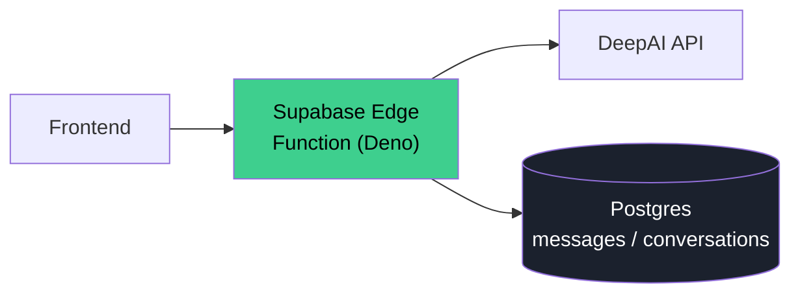
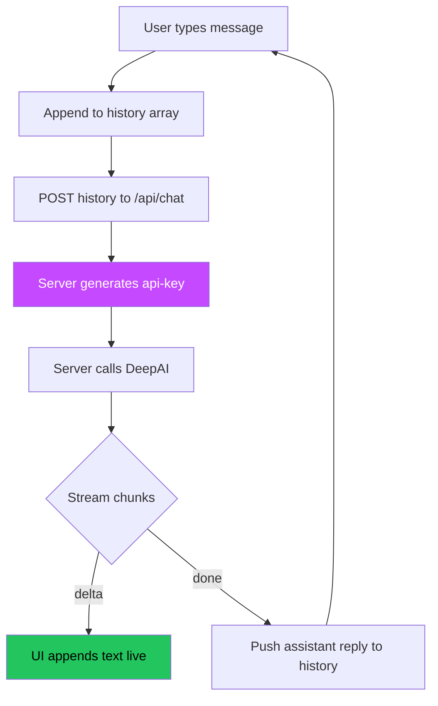

<!--
  ██████╗ ███████╗███████╗██████╗  █████╗ ██╗
  ██╔══██╗██╔════╝██╔════╝██╔══██╗██╔══██╗██║
  ██║  ██║█████╗  █████╗  ██████╔╝███████║██║
  ██║  ██║██╔══╝  ██╔══╝  ██╔═══╝ ██╔══██║██║
  ██████╔╝███████╗███████╗██║     ██║  ██║██║
  ╚═════╝ ╚══════╝╚══════╝╚═╝     ╚═╝  ╚═╝╚═╝
  THE COMPLETE, ALL-IN-ONE GUIDE — single Markdown file.
-->

# 🤖 Build Your Own Free AI Chatbot with the DeepAI API
## The Complete, All-in-One, A-to-Z Guide (single file — everything inside)

> **What you'll build:** a fully working web + CLI AI chatbot that talks to a real large language model, streams replies token-by-token, remembers the conversation, and costs **$0** — no API key, no credit card, no signup.
>
> **How:** by reverse-engineering the network flow behind `https://deepai.org/chat` and reproducing the exact request the website itself sends.
>
> **This one file contains EVERYTHING:** the reverse-engineering walkthrough, full working source in **JavaScript, TypeScript, Python, Go, and PHP**, backends for **Node, Next.js, and Supabase**, the **frontend UI**, **deployment**, **workflow diagrams**, **troubleshooting**, and an **API reference**. Copy any block straight into your editor.

---

> [!WARNING]
> ## ⚖️ Read this first — Legal & Ethical Notice
> This is an **educational** project for learning how to analyze and reproduce a web API (a core skill in QA, security research, and integration work).
> - It reproduces **exactly the request a normal anonymous browser sends** to deepai.org. It does **NOT** spoof IPs, forge fingerprints, or defeat anti-bot protection.
> - DeepAI's free tier is **rate-limited per IP/cookie**. Respect it. Don't scrape at scale, resell access, or hammer the endpoint.
> - This is an **undocumented endpoint**; it can change or break at any time. It is **not** a stable production API.
> - Read and honor [DeepAI's Terms of Service](https://deepai.org/terms). For reliability or commercial use, buy their official API.

---

## 📑 Table of Contents

1. [The Big Picture](#1-the-big-picture)
2. [Reverse Engineering DeepAI — step by step](#2-reverse-engineering-deepai--step-by-step)
3. [The Algorithm Explained](#3-the-algorithm-explained)
4. [Project Structure](#4-project-structure)
5. [Language Guide: JavaScript (Node)](#5-language-guide-javascript-node)
6. [Language Guide: TypeScript](#6-language-guide-typescript)
7. [Language Guide: Python](#7-language-guide-python)
8. [Language Guide: Go](#8-language-guide-go)
9. [Language Guide: PHP](#9-language-guide-php)
10. [Backend Guide: Zero-Dependency Node Server](#10-backend-guide-zero-dependency-node-server)
11. [Backend Guide: Next.js (App Router)](#11-backend-guide-nextjs-app-router)
12. [Backend Guide: Supabase (Edge Function + Postgres)](#12-backend-guide-supabase-edge-function--postgres)
13. [Frontend Guide: Web UI](#13-frontend-guide-web-ui)
14. [Frontend Guide: React Hook](#14-frontend-guide-react-hook)
15. [CLI Chatbot](#15-cli-chatbot)
16. [Workflow: How to Operate It](#16-workflow-how-to-operate-it)
17. [Deployment (free hosting)](#17-deployment-free-hosting)
18. [Models Reference](#18-models-reference)
19. [Troubleshooting](#19-troubleshooting)
20. [Full API Reference](#20-full-api-reference)
21. [FAQ](#21-faq)
22. [Glossary](#22-glossary)
23. [License](#23-license)

---

## 1. The Big Picture

A normal hosted AI chatbot looks like this:

```
Browser ──▶ Your Server ──▶ OpenAI/Anthropic (needs a $ API key) ──▶ reply
```

Ours replaces the paid provider with DeepAI's **public free chat endpoint**:

```
Browser ──▶ Your Server ──▶ api.deepai.org/hacking_is_a_serious_crime ──▶ streamed reply
                 │
                 └── generates the "api-key" itself (client-side algorithm)
```



**The key insight:** DeepAI's anonymous "try it" chat authenticates with an `api-key` header that is **computed entirely in the browser** by a JavaScript function. There is no server-issued secret. Once you understand the algorithm, you can generate valid keys yourself — for free, forever (subject to rate limits).

---

## 2. Reverse Engineering DeepAI — step by step

This is the part that matters. Every step is reproducible in Chrome DevTools.

### Step 1 — Open the page with DevTools
Go to `https://deepai.org/chat`, press **F12**, open the **Network** tab, tick **Preserve log**, and send a test message ("hello").

### Step 2 — Find the request
A `POST` appears to a deliberately-named URL:

```
POST https://api.deepai.org/hacking_is_a_serious_crime
```

(Yes — that's the real endpoint name. DeepAI's little joke.) The response is a **streamed plain-text body**, not JSON.

### Step 3 — Inspect the payload
The request body is `multipart/form-data` with these fields:

| field | value | purpose |
|-------|-------|---------|
| `chat_style` | `"chat"` | UI style |
| `chatHistory` | `[{role,content}, …]` JSON | the whole conversation |
| `model` | `"standard"` / `"online"` / … | which model |
| `session_uuid` | random UUID | conversation id |
| `sensitivity_request_id` | random UUID | moderation id |
| `hacker_is_stinky` | `"very_stinky"` | required literal flag |
| `enabled_tools` | `[]` JSON | image tools (optional) |

### Step 4 — Find the auth header
The only header that matters is:

```
api-key: tryit-82800029597-aae72839f9ef6066914f6a2a41534fcb
```

Where does that come from? Search the page source (Ctrl+F in **Sources**) for `api-key`. You'll land on calls like `headers:{'api-key':tryitApiKey}` and `tryitApiKey = generateIslandKey()`.

### Step 5 — Read `generateIslandKey()`
The minified source contains (de-minified):

```js
function generateIslandKey() {
  let rand = Math.round(Math.random() * 100000000000) + "";
  const H = makeHasher();           // an inline MD5 that returns reversed hex
  return "tryit-" + rand + "-" +
    H(UA + H(UA + H(UA + rand +
      "hackers_become_a_little_stinkier_every_time_they_hack")));
}
```

### Step 6 — The key insight
The hash is **MD5** (verifiable: `makeHasher` initializes the classic MD5 magic constants `1732584193, 4023233417`). The only twist is the digest is **reversed**. Because everything needed to build the key is in the client, we can generate valid keys ourselves — that's the whole "auth".

> ⚠️ Because the key is derived from `navigator.userAgent`, your client **must send the same `User-Agent` header** it used to compute the key. Mismatch = 401.

### Step 7 — Recap of all tokens



| Token | Source |
|-------|--------|
| `api-key` | computed locally by `generateIslandKey()` |
| `session_uuid` / `sensitivity_request_id` | random UUIDs you create |
| `hacker_is_stinky=very_stinky` | static literal |

Compare this to ChatGPT (CSRF + sentinel token + SHA3-512 **proof-of-work**): DeepAI's free tier is dramatically simpler because it has **no real server-side secret** in the anonymous path.

---

## 3. The Algorithm Explained

```
api-key = tryit-<rand>-<H( UA + H( UA + H( UA + rand + SALT ) ) )>

  rand = random 11-digit number       e.g. 82800029597
  UA   = the browser User-Agent       (must match the request header)
  SALT = "hackers_become_a_little_stinkier_every_time_they_hack"
  H(x) = MD5(x) in hex, then the string reversed
```

Worked example (conceptual):

```
rand = "82800029597"
inner1 = H(UA + rand + SALT)          # reversed-MD5
inner2 = H(UA + inner1)               # reversed-MD5
final  = H(UA + inner2)               # reversed-MD5
key    = "tryit-82800029597-" + final
```

That `key` goes in the `api-key` header. Send it with the matching `User-Agent`, and DeepAI accepts the request.

---

## 4. Project Structure

If you want to lay this out as a repo, here's the recommended structure (everything below is fully provided in this guide):

```
deepai-chatbot/
├── server/
│   ├── deepai.js        # core client (MD5 + key gen + chat)   [JS]
│   └── index.js         # zero-dependency HTTP server + SSE proxy
├── public/
│   ├── index.html       # chat UI
│   └── app.js           # frontend streaming logic
├── cli.js               # terminal chatbot
├── clients/
│   ├── typescript/deepai.ts
│   ├── python/deepai.py
│   ├── go/deepai.go
│   └── php/deepai.php
├── backends/
│   └── supabase/
│       ├── functions/chat/index.ts   # Deno edge function
│       └── schema.sql                # Postgres + RLS
└── examples/
    ├── react/useDeepAIChat.ts        # React hook
    └── nextjs/route.ts               # Next.js App Router endpoint
```

**Requirements:** Node.js **18+** (built-in `fetch`, `FormData`, `crypto.randomUUID`). Check with `node -v`.

---

## 5. Language Guide: JavaScript (Node)

> File: `server/deepai.js` — **zero dependencies** (uses Node's built-in `crypto` + global `fetch`). Node 18+.

```js
/**
 * deepai.js — DeepAI free-chat client (reverse-engineered, no API payment).
 * Reproduces the public anonymous flow of deepai.org/chat. Node 18+.
 */
const APP_BASE_URL = "https://api.deepai.org";
const ENDPOINT = "/hacking_is_a_serious_crime";
const SALT = "hackers_become_a_little_stinkier_every_time_they_hack";
const USER_AGENT =
  "Mozilla/5.0 (Windows NT 10.0; Win64; x64) AppleWebKit/537.36 " +
  "(KHTML, like Gecko) Chrome/132.0.0.0 Safari/537.36";
const FREE_MODELS = ["standard", "online"];

/* ----------------------------- MD5 (hex) ----------------------------- */
function md5hex(s) {
  const rl = (n, c) => (n << c) | (n >>> (32 - c));
  const add = (x, y) => {
    const l = (x & 0xffff) + (y & 0xffff);
    return (((x >> 16) + (y >> 16) + (l >> 16)) << 16) | (l & 0xffff);
  };
  const cmn = (q, a, b, x, s, t) => add(rl(add(add(a, q), add(x, t)), s), b);
  const ff = (a, b, c, d, x, s, t) => cmn((b & c) | (~b & d), a, b, x, s, t);
  const gg = (a, b, c, d, x, s, t) => cmn((b & d) | (c & ~d), a, b, x, s, t);
  const hh = (a, b, c, d, x, s, t) => cmn(b ^ c ^ d, a, b, x, s, t);
  const ii = (a, b, c, d, x, s, t) => cmn(c ^ (b | ~d), a, b, x, s, t);
  const toBlocks = (str) => {
    const bytes = unescape(encodeURIComponent(str));
    const n = bytes.length;
    const blks = [];
    for (let i = 0; i < n; i++) blks[i >> 2] |= bytes.charCodeAt(i) << ((i % 4) * 8);
    blks[n >> 2] |= 0x80 << ((n % 4) * 8);
    blks[(((n + 8) >> 6) + 1) * 16 - 2] = n * 8;
    return blks;
  };
  const x = toBlocks(s);
  let a = 1732584193, b = -271733879, c = -1732584194, d = 271733878;
  for (let i = 0; i < x.length; i += 16) {
    const oa = a, ob = b, oc = c, od = d;
    a = ff(a, b, c, d, x[i] | 0, 7, -680876936); d = ff(d, a, b, c, x[i + 1] | 0, 12, -389564586);
    c = ff(c, d, a, b, x[i + 2] | 0, 17, 606105819); b = ff(b, c, d, a, x[i + 3] | 0, 22, -1044525330);
    a = ff(a, b, c, d, x[i + 4] | 0, 7, -176418897); d = ff(d, a, b, c, x[i + 5] | 0, 12, 1200080426);
    c = ff(c, d, a, b, x[i + 6] | 0, 17, -1473231341); b = ff(b, c, d, a, x[i + 7] | 0, 22, -45705983);
    a = ff(a, b, c, d, x[i + 8] | 0, 7, 1770035416); d = ff(d, a, b, c, x[i + 9] | 0, 12, -1958414417);
    c = ff(c, d, a, b, x[i + 10] | 0, 17, -42063); b = ff(b, c, d, a, x[i + 11] | 0, 22, -1990404162);
    a = ff(a, b, c, d, x[i + 12] | 0, 7, 1804603682); d = ff(d, a, b, c, x[i + 13] | 0, 12, -40341101);
    c = ff(c, d, a, b, x[i + 14] | 0, 17, -1502002290); b = ff(b, c, d, a, x[i + 15] | 0, 22, 1236535329);
    a = gg(a, b, c, d, x[i + 1] | 0, 5, -165796510); d = gg(d, a, b, c, x[i + 6] | 0, 9, -1069501632);
    c = gg(c, d, a, b, x[i + 11] | 0, 14, 643717713); b = gg(b, c, d, a, x[i] | 0, 20, -373897302);
    a = gg(a, b, c, d, x[i + 5] | 0, 5, -701558691); d = gg(d, a, b, c, x[i + 10] | 0, 9, 38016083);
    c = gg(c, d, a, b, x[i + 15] | 0, 14, -660478335); b = gg(b, c, d, a, x[i + 4] | 0, 20, -405537848);
    a = gg(a, b, c, d, x[i + 9] | 0, 5, 568446438); d = gg(d, a, b, c, x[i + 14] | 0, 9, -1019803690);
    c = gg(c, d, a, b, x[i + 3] | 0, 14, -187363961); b = gg(b, c, d, a, x[i + 8] | 0, 20, 1163531501);
    a = gg(a, b, c, d, x[i + 13] | 0, 5, -1444681467); d = gg(d, a, b, c, x[i + 2] | 0, 9, -51403784);
    c = gg(c, d, a, b, x[i + 7] | 0, 14, 1735328473); b = gg(b, c, d, a, x[i + 12] | 0, 20, -1926607734);
    a = hh(a, b, c, d, x[i + 5] | 0, 4, -378558); d = hh(d, a, b, c, x[i + 8] | 0, 11, -2022574463);
    c = hh(c, d, a, b, x[i + 11] | 0, 16, 1839030562); b = hh(b, c, d, a, x[i + 14] | 0, 23, -35309556);
    a = hh(a, b, c, d, x[i + 1] | 0, 4, -1530992060); d = hh(d, a, b, c, x[i + 4] | 0, 11, 1272893353);
    c = hh(c, d, a, b, x[i + 7] | 0, 16, -155497632); b = hh(b, c, d, a, x[i + 10] | 0, 23, -1094730640);
    a = hh(a, b, c, d, x[i + 13] | 0, 4, 681279174); d = hh(d, a, b, c, x[i] | 0, 11, -358537222);
    c = hh(c, d, a, b, x[i + 3] | 0, 16, -722521979); b = hh(b, c, d, a, x[i + 6] | 0, 23, 76029189);
    a = hh(a, b, c, d, x[i + 9] | 0, 4, -640364487); d = hh(d, a, b, c, x[i + 12] | 0, 11, -421815835);
    c = hh(c, d, a, b, x[i + 15] | 0, 16, 530742520); b = hh(b, c, d, a, x[i + 2] | 0, 23, -995338651);
    a = ii(a, b, c, d, x[i] | 0, 6, -198630844); d = ii(d, a, b, c, x[i + 7] | 0, 10, 1126891415);
    c = ii(c, d, a, b, x[i + 14] | 0, 15, -1416354905); b = ii(b, c, d, a, x[i + 5] | 0, 21, -57434055);
    a = ii(a, b, c, d, x[i + 12] | 0, 6, 1700485571); d = ii(d, a, b, c, x[i + 3] | 0, 10, -1894986606);
    c = ii(c, d, a, b, x[i + 10] | 0, 15, -1051523); b = ii(b, c, d, a, x[i + 1] | 0, 21, -2054922799);
    a = ii(a, b, c, d, x[i + 8] | 0, 6, 1873313359); d = ii(d, a, b, c, x[i + 15] | 0, 10, -30611744);
    c = ii(c, d, a, b, x[i + 6] | 0, 15, -1560198380); b = ii(b, c, d, a, x[i + 13] | 0, 21, 1309151649);
    a = ii(a, b, c, d, x[i + 4] | 0, 6, -145523070); d = ii(d, a, b, c, x[i + 11] | 0, 10, -1120210379);
    c = ii(c, d, a, b, x[i + 2] | 0, 15, 718787259); b = ii(b, c, d, a, x[i + 9] | 0, 21, -343485551);
    a = add(a, oa); b = add(b, ob); c = add(c, oc); d = add(d, od);
  }
  const hex = (n) => {
    let s = "";
    for (let i = 0; i < 4; i++)
      s += ((n >> (i * 8 + 4)) & 0x0f).toString(16) + ((n >> (i * 8)) & 0x0f).toString(16);
    return s;
  };
  return hex(a) + hex(b) + hex(c) + hex(d);
}
const H = (input) => md5hex(input).split("").reverse().join("");

function generateIslandKey(userAgent = USER_AGENT) {
  const rand = Math.round(Math.random() * 100000000000) + "";
  return "tryit-" + rand + "-" + H(userAgent + H(userAgent + H(userAgent + rand + SALT)));
}

/**
 * Send a conversation and stream the reply.
 * @param {Array<{role:'user'|'assistant'|'system', content:string}>} messages
 * @param {{model?:string, onChunk?:(t:string)=>void, signal?:AbortSignal}} opts
 * @returns {Promise<string>} full reply text
 */
async function chat(messages, opts = {}) {
  const model = opts.model && FREE_MODELS.includes(opts.model) ? opts.model : "standard";
  const form = new FormData();
  form.append("chat_style", "chat");
  form.append("chatHistory", JSON.stringify(messages));
  form.append("model", model);
  form.append("session_uuid", crypto.randomUUID());
  form.append("sensitivity_request_id", crypto.randomUUID());
  form.append("hacker_is_stinky", "very_stinky");
  form.append("enabled_tools", JSON.stringify([]));

  const res = await fetch(APP_BASE_URL + ENDPOINT, {
    method: "POST",
    body: form,
    signal: opts.signal,
    headers: {
      "api-key": generateIslandKey(),
      "User-Agent": USER_AGENT,
      Origin: "https://deepai.org",
      Referer: "https://deepai.org/",
    },
  });

  if (!res.ok) {
    let detail = "";
    try { detail = (await res.json()).status || ""; } catch {}
    if (res.status === 401) throw new Error(detail || "Anonymous limit reached or model not free (401).");
    throw new Error(`DeepAI HTTP ${res.status}: ${detail || res.statusText}`);
  }
  if (!res.body) throw new Error("Empty response body from DeepAI.");

  const reader = res.body.getReader();
  const decoder = new TextDecoder();
  let full = "";
  while (true) {
    const { done, value } = await reader.read();
    if (done) break;
    const chunk = decoder.decode(value, { stream: true });
    full += chunk;
    if (opts.onChunk) opts.onChunk(chunk);
  }
  return full;
}

module.exports = { chat, generateIslandKey, md5hex, FREE_MODELS, USER_AGENT };
```

**Use it:**
```js
const { chat } = require("./deepai");
(async () => {
  const reply = await chat(
    [{ role: "user", content: "Hello!" }],
    { onChunk: (t) => process.stdout.write(t) }
  );
  console.log("\nFull:", reply);
})();
```

---

## 6. Language Guide: TypeScript

> File: `clients/typescript/deepai.ts` — runs on Node 18+, Deno, Bun.

```ts
import { createHash, randomUUID } from "node:crypto";

const APP_BASE_URL = "https://api.deepai.org";
const ENDPOINT = "/hacking_is_a_serious_crime";
const SALT = "hackers_become_a_little_stinkier_every_time_they_hack";
const USER_AGENT =
  "Mozilla/5.0 (Windows NT 10.0; Win64; x64) AppleWebKit/537.36 " +
  "(KHTML, like Gecko) Chrome/132.0.0.0 Safari/537.36";

export const FREE_MODELS = ["standard", "online"] as const;
export type FreeModel = (typeof FREE_MODELS)[number];

export interface Message {
  role: "user" | "assistant" | "system";
  content: string;
}
export interface ChatOptions {
  model?: FreeModel;
  onChunk?: (text: string) => void;
  signal?: AbortSignal;
}

/** MD5 hex digest, reversed — matches DeepAI's inline hasher. */
function h(input: string): string {
  return createHash("md5").update(input, "utf8").digest("hex").split("").reverse().join("");
}

export function generateIslandKey(userAgent: string = USER_AGENT): string {
  const rand = Math.round(Math.random() * 100_000_000_000).toString();
  return "tryit-" + rand + "-" + h(userAgent + h(userAgent + h(userAgent + rand + SALT)));
}

export async function chat(messages: Message[], opts: ChatOptions = {}): Promise<string> {
  const model: FreeModel =
    opts.model && FREE_MODELS.includes(opts.model) ? opts.model : "standard";

  const form = new FormData();
  form.append("chat_style", "chat");
  form.append("chatHistory", JSON.stringify(messages));
  form.append("model", model);
  form.append("session_uuid", randomUUID());
  form.append("sensitivity_request_id", randomUUID());
  form.append("hacker_is_stinky", "very_stinky");
  form.append("enabled_tools", "[]");

  const res = await fetch(APP_BASE_URL + ENDPOINT, {
    method: "POST",
    body: form,
    signal: opts.signal,
    headers: {
      "api-key": generateIslandKey(),
      "User-Agent": USER_AGENT,
      Origin: "https://deepai.org",
      Referer: "https://deepai.org/",
    },
  });

  if (res.status === 401)
    throw new Error("401: anonymous limit reached or model is paid-only. Use 'standard'.");
  if (!res.ok || !res.body) throw new Error(`DeepAI HTTP ${res.status}`);

  const reader = res.body.getReader();
  const decoder = new TextDecoder();
  let full = "";
  for (;;) {
    const { done, value } = await reader.read();
    if (done) break;
    const chunk = decoder.decode(value, { stream: true });
    full += chunk;
    opts.onChunk?.(chunk);
  }
  return full;
}

/** Async-generator variant for `for await` streaming. */
export async function* stream(messages: Message[], opts: ChatOptions = {}): AsyncGenerator<string> {
  const model: FreeModel =
    opts.model && FREE_MODELS.includes(opts.model) ? opts.model : "standard";
  const form = new FormData();
  form.append("chat_style", "chat");
  form.append("chatHistory", JSON.stringify(messages));
  form.append("model", model);
  form.append("session_uuid", randomUUID());
  form.append("sensitivity_request_id", randomUUID());
  form.append("hacker_is_stinky", "very_stinky");
  form.append("enabled_tools", "[]");

  const res = await fetch(APP_BASE_URL + ENDPOINT, {
    method: "POST",
    body: form,
    signal: opts.signal,
    headers: {
      "api-key": generateIslandKey(),
      "User-Agent": USER_AGENT,
      Origin: "https://deepai.org",
      Referer: "https://deepai.org/",
    },
  });
  if (!res.ok || !res.body) throw new Error(`DeepAI HTTP ${res.status}`);
  const reader = res.body.getReader();
  const decoder = new TextDecoder();
  for (;;) {
    const { done, value } = await reader.read();
    if (done) break;
    yield decoder.decode(value, { stream: true });
  }
}
```

**Use it:**
```ts
import { chat, stream } from "./deepai";
console.log(await chat([{ role: "user", content: "Hello!" }]));
for await (const c of stream([{ role: "user", content: "Tell me a joke" }])) process.stdout.write(c);
```

---

## 7. Language Guide: Python

> File: `clients/python/deepai.py` — Python 3.8+. `pip install requests`.

```python
"""
deepai.py — DeepAI free-chat client (reverse-engineered, no API payment).
Reproduces the public anonymous flow of deepai.org/chat. Educational use only.
"""
from __future__ import annotations
import hashlib, json, random, uuid
from typing import Callable, Iterable
import requests

APP_BASE_URL = "https://api.deepai.org"
ENDPOINT = "/hacking_is_a_serious_crime"
SALT = "hackers_become_a_little_stinkier_every_time_they_hack"
USER_AGENT = (
    "Mozilla/5.0 (Windows NT 10.0; Win64; x64) AppleWebKit/537.36 "
    "(KHTML, like Gecko) Chrome/132.0.0.0 Safari/537.36"
)
FREE_MODELS = ("standard", "online")


def _h(text: str) -> str:
    """MD5 hex digest, reversed — matches DeepAI's inline hasher."""
    return hashlib.md5(text.encode("utf-8")).hexdigest()[::-1]


def generate_island_key(user_agent: str = USER_AGENT) -> str:
    rand = str(round(random.random() * 100_000_000_000))
    return "tryit-" + rand + "-" + _h(
        user_agent + _h(user_agent + _h(user_agent + rand + SALT))
    )


def _form(messages: list[dict], model: str) -> dict:
    if model not in FREE_MODELS:
        model = "standard"
    return {
        "chat_style": "chat",
        "chatHistory": json.dumps(messages),
        "model": model,
        "session_uuid": str(uuid.uuid4()),
        "sensitivity_request_id": str(uuid.uuid4()),
        "hacker_is_stinky": "very_stinky",
        "enabled_tools": "[]",
    }


def _headers() -> dict:
    return {
        "api-key": generate_island_key(),
        "User-Agent": USER_AGENT,
        "Origin": "https://deepai.org",
        "Referer": "https://deepai.org/",
    }


def chat(messages: list[dict], model: str = "standard",
         on_chunk: Callable[[str], None] | None = None) -> str:
    """Send a conversation and return the full reply (streams under the hood)."""
    with requests.post(APP_BASE_URL + ENDPOINT, data=_form(messages, model),
                       headers=_headers(), stream=True, timeout=60) as resp:
        if resp.status_code == 401:
            raise RuntimeError("401: anonymous limit reached or model is paid-only.")
        resp.raise_for_status()
        full = []
        for chunk in resp.iter_content(chunk_size=None, decode_unicode=True):
            if not chunk:
                continue
            full.append(chunk)
            if on_chunk:
                on_chunk(chunk)
        return "".join(full)


def stream(messages: list[dict], model: str = "standard") -> Iterable[str]:
    """Generator variant: yield chunks as they arrive."""
    with requests.post(APP_BASE_URL + ENDPOINT, data=_form(messages, model),
                       headers=_headers(), stream=True, timeout=60) as resp:
        resp.raise_for_status()
        for chunk in resp.iter_content(chunk_size=None, decode_unicode=True):
            if chunk:
                yield chunk


if __name__ == "__main__":
    import sys
    prompt = " ".join(sys.argv[1:]) or "Hello, who are you?"
    print(f"You: {prompt}\nAI: ", end="", flush=True)
    chat([{"role": "user", "content": prompt}], on_chunk=lambda t: print(t, end="", flush=True))
    print()
```

**`requirements.txt`:**
```
requests>=2.28.0
```

**Run:** `python deepai.py "What is the capital of Japan?"` → `Tokyo.`

---

## 8. Language Guide: Go

> File: `clients/go/deepai.go` — Go 1.21+. `go get github.com/google/uuid`.

```go
package main

import (
	"bufio"
	"crypto/md5"
	"encoding/hex"
	"encoding/json"
	"fmt"
	"io"
	"math/rand"
	"mime/multipart"
	"net/http"
	"os"
	"strings"

	"github.com/google/uuid"
)

const (
	baseURL   = "https://api.deepai.org"
	endpoint  = "/hacking_is_a_serious_crime"
	salt      = "hackers_become_a_little_stinkier_every_time_they_hack"
	userAgent = "Mozilla/5.0 (Windows NT 10.0; Win64; x64) AppleWebKit/537.36 " +
		"(KHTML, like Gecko) Chrome/132.0.0.0 Safari/537.36"
)

type Message struct {
	Role    string `json:"role"`
	Content string `json:"content"`
}

func reversedMD5(s string) string {
	sum := md5.Sum([]byte(s))
	h := hex.EncodeToString(sum[:])
	r := []rune(h)
	for i, j := 0, len(r)-1; i < j; i, j = i+1, j-1 {
		r[i], r[j] = r[j], r[i]
	}
	return string(r)
}

func GenerateIslandKey() string {
	randStr := fmt.Sprintf("%d", int64(rand.Float64()*1e11))
	return "tryit-" + randStr + "-" +
		reversedMD5(userAgent+reversedMD5(userAgent+reversedMD5(userAgent+randStr+salt)))
}

func Chat(messages []Message, model string, onChunk func(string)) (string, error) {
	if model != "standard" && model != "online" {
		model = "standard"
	}
	history, _ := json.Marshal(messages)

	var body strings.Builder
	w := multipart.NewWriter(&body)
	fields := map[string]string{
		"chat_style":             "chat",
		"chatHistory":            string(history),
		"model":                  model,
		"session_uuid":           uuid.NewString(),
		"sensitivity_request_id": uuid.NewString(),
		"hacker_is_stinky":       "very_stinky",
		"enabled_tools":          "[]",
	}
	for k, v := range fields {
		_ = w.WriteField(k, v)
	}
	w.Close()

	req, _ := http.NewRequest("POST", baseURL+endpoint, strings.NewReader(body.String()))
	req.Header.Set("Content-Type", w.FormDataContentType())
	req.Header.Set("api-key", GenerateIslandKey())
	req.Header.Set("User-Agent", userAgent)
	req.Header.Set("Origin", "https://deepai.org")
	req.Header.Set("Referer", "https://deepai.org/")

	resp, err := http.DefaultClient.Do(req)
	if err != nil {
		return "", err
	}
	defer resp.Body.Close()
	if resp.StatusCode == 401 {
		return "", fmt.Errorf("401: anonymous limit reached or paid-only model")
	}

	var full strings.Builder
	reader := bufio.NewReader(resp.Body)
	buf := make([]byte, 1024)
	for {
		n, err := reader.Read(buf)
		if n > 0 {
			chunk := string(buf[:n])
			full.WriteString(chunk)
			if onChunk != nil {
				onChunk(chunk)
			}
		}
		if err == io.EOF {
			break
		}
		if err != nil {
			return full.String(), err
		}
	}
	return full.String(), nil
}

func main() {
	prompt := "Hello, who are you?"
	if len(os.Args) > 1 {
		prompt = strings.Join(os.Args[1:], " ")
	}
	fmt.Printf("You: %s\nAI: ", prompt)
	_, err := Chat([]Message{{Role: "user", Content: prompt}}, "standard",
		func(t string) { fmt.Print(t) })
	if err != nil {
		fmt.Println("\nERROR:", err)
		os.Exit(1)
	}
	fmt.Println()
}
```

**`go.mod`:**
```
module deepai-chatbot/client

go 1.21

require github.com/google/uuid v1.6.0
```

**Run:** `go mod tidy && go run deepai.go "Hello"`

---

## 9. Language Guide: PHP

> File: `clients/php/deepai.php` — PHP 7.4+ with cURL.

```php
<?php
const DEEPAI_BASE = "https://api.deepai.org";
const DEEPAI_ENDPOINT = "/hacking_is_a_serious_crime";
const DEEPAI_SALT = "hackers_become_a_little_stinkier_every_time_they_hack";
const DEEPAI_UA = "Mozilla/5.0 (Windows NT 10.0; Win64; x64) AppleWebKit/537.36 "
    . "(KHTML, like Gecko) Chrome/132.0.0.0 Safari/537.36";

/** MD5 hex digest, reversed. */
function deepai_h(string $s): string {
    return strrev(md5($s));
}

function generate_island_key(string $ua = DEEPAI_UA): string {
    $rand = (string) round(mt_rand() / mt_getrandmax() * 100000000000);
    return "tryit-" . $rand . "-" .
        deepai_h($ua . deepai_h($ua . deepai_h($ua . $rand . DEEPAI_SALT)));
}

function uuid4(): string {
    $d = random_bytes(16);
    $d[6] = chr((ord($d[6]) & 0x0f) | 0x40);
    $d[8] = chr((ord($d[8]) & 0x3f) | 0x80);
    return vsprintf('%s%s-%s-%s-%s-%s%s%s', str_split(bin2hex($d), 4));
}

function deepai_chat(array $messages, string $model = "standard", ?callable $onChunk = null): string {
    if (!in_array($model, ["standard", "online"], true)) $model = "standard";
    $fields = [
        "chat_style"             => "chat",
        "chatHistory"            => json_encode($messages),
        "model"                  => $model,
        "session_uuid"           => uuid4(),
        "sensitivity_request_id" => uuid4(),
        "hacker_is_stinky"       => "very_stinky",
        "enabled_tools"          => "[]",
    ];
    $full = "";
    $ch = curl_init(DEEPAI_BASE . DEEPAI_ENDPOINT);
    curl_setopt_array($ch, [
        CURLOPT_POST => true,
        CURLOPT_POSTFIELDS => $fields,
        CURLOPT_HTTPHEADER => [
            "api-key: " . generate_island_key(),
            "User-Agent: " . DEEPAI_UA,
            "Origin: https://deepai.org",
            "Referer: https://deepai.org/",
        ],
        CURLOPT_WRITEFUNCTION => function ($ch, $chunk) use (&$full, $onChunk) {
            $full .= $chunk;
            if ($onChunk) $onChunk($chunk);
            return strlen($chunk);
        },
    ]);
    curl_exec($ch);
    $code = curl_getinfo($ch, CURLINFO_HTTP_CODE);
    curl_close($ch);
    if ($code === 401) throw new RuntimeException("401: anonymous limit reached or paid-only model.");
    return $full;
}

if (php_sapi_name() === "cli" && isset($argv)) {
    $prompt = count($argv) > 1 ? implode(" ", array_slice($argv, 1)) : "Hello, who are you?";
    echo "You: $prompt\nAI: ";
    deepai_chat([["role" => "user", "content" => $prompt]], "standard",
        function ($t) { echo $t; flush(); });
    echo "\n";
}
```

**Run:** `php deepai.php "Hello"`

---

## 10. Backend Guide: Zero-Dependency Node Server

Why a backend? **CORS** (browsers can't call `api.deepai.org` cross-origin), to hide the algorithm, and to add your own rate limiting / system prompt.

> File: `server/index.js` — serves the UI and exposes `POST /api/chat` (SSE). Run: `node server/index.js`.

```js
const http = require("http");
const fs = require("fs");
const path = require("path");
const { chat, FREE_MODELS } = require("./deepai");

const PORT = process.env.PORT || 3000;
const PUBLIC = path.join(__dirname, "..", "public");

const MIME = {
  ".html": "text/html; charset=utf-8",
  ".js": "text/javascript; charset=utf-8",
  ".css": "text/css; charset=utf-8",
  ".json": "application/json; charset=utf-8",
  ".svg": "image/svg+xml",
};

// per-IP rate limiter (good citizen)
const hits = new Map();
const WINDOW = 60_000, MAX = 20;
function limited(ip) {
  const now = Date.now();
  const arr = (hits.get(ip) || []).filter((t) => now - t < WINDOW);
  arr.push(now);
  hits.set(ip, arr);
  return arr.length > MAX;
}

function serveStatic(req, res) {
  let rel = decodeURIComponent(req.url.split("?")[0]);
  if (rel === "/") rel = "/index.html";
  const file = path.join(PUBLIC, path.normalize(rel).replace(/^(\.\.[/\\])+/, ""));
  if (!file.startsWith(PUBLIC)) { res.writeHead(403).end("Forbidden"); return; }
  fs.readFile(file, (err, data) => {
    if (err) { res.writeHead(404).end("Not found"); return; }
    res.writeHead(200, { "Content-Type": MIME[path.extname(file)] || "application/octet-stream" });
    res.end(data);
  });
}

const server = http.createServer(async (req, res) => {
  if (req.method === "POST" && req.url === "/api/chat") {
    const ip = (req.headers["x-forwarded-for"] || req.socket.remoteAddress || "?").split(",")[0];
    if (limited(ip)) { res.writeHead(429).end("Too many requests"); return; }

    let body = "";
    req.on("data", (c) => { body += c; if (body.length > 1e6) req.destroy(); });
    req.on("end", async () => {
      let payload;
      try { payload = JSON.parse(body || "{}"); } catch { res.writeHead(400).end("Bad JSON"); return; }
      const messages = Array.isArray(payload.messages) ? payload.messages : [];
      const model = FREE_MODELS.includes(payload.model) ? payload.model : "standard";
      if (!messages.length) { res.writeHead(400).end("messages[] required"); return; }

      res.writeHead(200, {
        "Content-Type": "text/event-stream",
        "Cache-Control": "no-cache",
        Connection: "keep-alive",
      });
      const send = (obj) => res.write(`data: ${JSON.stringify(obj)}\n\n`);
      try {
        await chat(messages, { model, onChunk: (t) => send({ delta: t }) });
        send({ done: true });
      } catch (e) {
        send({ error: e.message });
      } finally {
        res.end();
      }
    });
    return;
  }
  if (req.method === "GET") return serveStatic(req, res);
  res.writeHead(405).end("Method not allowed");
});

server.listen(PORT, () => console.log(`\n  DeepAI Chatbot → http://localhost:${PORT}\n`));
```

**`package.json`:**
```json
{
  "name": "deepai-chatbot",
  "version": "1.0.0",
  "type": "commonjs",
  "main": "server/index.js",
  "scripts": { "start": "node server/index.js", "cli": "node cli.js" },
  "engines": { "node": ">=18" },
  "license": "MIT"
}
```

---

## 11. Backend Guide: Next.js (App Router)

> File: `app/api/chat/route.ts` — Next.js 13+/14/15. Deploy to Vercel as-is.

```ts
import { createHash, randomUUID } from "node:crypto";

export const runtime = "nodejs"; // needs node:crypto for MD5
export const dynamic = "force-dynamic";

const SALT = "hackers_become_a_little_stinkier_every_time_they_hack";
const UA =
  "Mozilla/5.0 (Windows NT 10.0; Win64; x64) AppleWebKit/537.36 " +
  "(KHTML, like Gecko) Chrome/132.0.0.0 Safari/537.36";
const FREE = new Set(["standard", "online"]);

const h = (s: string) => createHash("md5").update(s, "utf8").digest("hex").split("").reverse().join("");
const islandKey = () => {
  const r = Math.round(Math.random() * 1e11).toString();
  return "tryit-" + r + "-" + h(UA + h(UA + h(UA + r + SALT)));
};

export async function POST(req: Request) {
  const { messages, model } = await req.json();
  const chosen = FREE.has(model) ? model : "standard";

  const form = new FormData();
  form.append("chat_style", "chat");
  form.append("chatHistory", JSON.stringify(messages ?? []));
  form.append("model", chosen);
  form.append("session_uuid", randomUUID());
  form.append("sensitivity_request_id", randomUUID());
  form.append("hacker_is_stinky", "very_stinky");
  form.append("enabled_tools", "[]");

  const upstream = await fetch("https://api.deepai.org/hacking_is_a_serious_crime", {
    method: "POST",
    body: form,
    headers: { "api-key": islandKey(), "User-Agent": UA, Origin: "https://deepai.org", Referer: "https://deepai.org/" },
  });
  if (!upstream.ok || !upstream.body)
    return new Response(JSON.stringify({ error: `DeepAI ${upstream.status}` }), { status: 502 });

  const stream = new ReadableStream({
    async start(controller) {
      const reader = upstream.body!.getReader();
      const dec = new TextDecoder();
      const enc = new TextEncoder();
      for (;;) {
        const { done, value } = await reader.read();
        if (done) break;
        const chunk = dec.decode(value, { stream: true });
        controller.enqueue(enc.encode(`data: ${JSON.stringify({ delta: chunk })}\n\n`));
      }
      controller.enqueue(enc.encode(`data: ${JSON.stringify({ done: true })}\n\n`));
      controller.close();
    },
  });
  return new Response(stream, { headers: { "Content-Type": "text/event-stream", "Cache-Control": "no-cache" } });
}
```

---

## 12. Backend Guide: Supabase (Edge Function + Postgres)

A complete serverless backend with **conversation persistence**.

### 12.1 Deploy steps
```bash
# 1. Create the tables (run schema.sql in the Supabase SQL editor)
# 2. Deploy:
supabase functions deploy chat --no-verify-jwt
# 3. Call:
curl -N -X POST "$SUPABASE_URL/functions/v1/chat" \
  -H "Content-Type: application/json" \
  -d '{"messages":[{"role":"user","content":"Hi!"}],"model":"standard"}'
```



### 12.2 `schema.sql`
```sql
-- Conversations
create table if not exists public.conversations (
  id          uuid primary key default gen_random_uuid(),
  user_id     uuid references auth.users (id) on delete cascade,
  title       text default 'New chat',
  created_at  timestamptz default now()
);

-- Messages
create table if not exists public.messages (
  id              bigint generated always as identity primary key,
  conversation_id uuid references public.conversations (id) on delete cascade,
  user_id         uuid references auth.users (id) on delete cascade,
  role            text not null check (role in ('user','assistant','system')),
  content         text not null,
  created_at      timestamptz default now()
);
create index if not exists idx_messages_conversation on public.messages (conversation_id, created_at);

-- Row Level Security
alter table public.conversations enable row level security;
alter table public.messages      enable row level security;
create policy "own conversations" on public.conversations
  for all using (auth.uid() = user_id) with check (auth.uid() = user_id);
create policy "own messages" on public.messages
  for all using (auth.uid() = user_id) with check (auth.uid() = user_id);
```

### 12.3 `functions/chat/index.ts` (Deno)
> Web Crypto has no MD5, so the function ships a tiny pure-JS MD5 (the same `md5()` from §5; paste it at the bottom). The handler:

```ts
import { createClient } from "https://esm.sh/@supabase/supabase-js@2";

const SALT = "hackers_become_a_little_stinkier_every_time_they_hack";
const UA =
  "Mozilla/5.0 (Windows NT 10.0; Win64; x64) AppleWebKit/537.36 " +
  "(KHTML, like Gecko) Chrome/132.0.0.0 Safari/537.36";
const FREE = new Set(["standard", "online"]);
const CORS = {
  "Access-Control-Allow-Origin": "*",
  "Access-Control-Allow-Headers": "authorization, x-client-info, apikey, content-type",
  "Access-Control-Allow-Methods": "POST, OPTIONS",
};

const h = (s: string) => md5(s).split("").reverse().join("");          // md5() defined below
function islandKey(): string {
  const rand = Math.round(Math.random() * 1e11).toString();
  return "tryit-" + rand + "-" + h(UA + h(UA + h(UA + rand + SALT)));
}

Deno.serve(async (req) => {
  if (req.method === "OPTIONS") return new Response("ok", { headers: CORS });
  try {
    const { messages, model } = await req.json();
    const chosen = FREE.has(model) ? model : "standard";

    const form = new FormData();
    form.append("chat_style", "chat");
    form.append("chatHistory", JSON.stringify(messages ?? []));
    form.append("model", chosen);
    form.append("session_uuid", crypto.randomUUID());
    form.append("sensitivity_request_id", crypto.randomUUID());
    form.append("hacker_is_stinky", "very_stinky");
    form.append("enabled_tools", "[]");

    const upstream = await fetch("https://api.deepai.org/hacking_is_a_serious_crime", {
      method: "POST", body: form,
      headers: { "api-key": islandKey(), "User-Agent": UA, Origin: "https://deepai.org", Referer: "https://deepai.org/" },
    });
    if (!upstream.ok || !upstream.body)
      return new Response(JSON.stringify({ error: `DeepAI ${upstream.status}` }),
        { status: 502, headers: { ...CORS, "Content-Type": "application/json" } });

    const url = Deno.env.get("SUPABASE_URL");
    const key = Deno.env.get("SUPABASE_SERVICE_ROLE_KEY");
    let full = "";

    const stream = new ReadableStream({
      async start(controller) {
        const reader = upstream.body!.getReader();
        const dec = new TextDecoder(); const enc = new TextEncoder();
        for (;;) {
          const { done, value } = await reader.read();
          if (done) break;
          const chunk = dec.decode(value, { stream: true });
          full += chunk;
          controller.enqueue(enc.encode(`data: ${JSON.stringify({ delta: chunk })}\n\n`));
        }
        controller.enqueue(enc.encode(`data: ${JSON.stringify({ done: true })}\n\n`));
        controller.close();
        if (url && key && Array.isArray(messages)) {
          try {
            const sb = createClient(url, key);
            await sb.from("messages").insert([
              { role: "user", content: messages.at(-1)?.content ?? "" },
              { role: "assistant", content: full },
            ]);
          } catch (_) {}
        }
      },
    });
    return new Response(stream, { headers: { ...CORS, "Content-Type": "text/event-stream", "Cache-Control": "no-cache" } });
  } catch (e) {
    return new Response(JSON.stringify({ error: String(e) }),
      { status: 400, headers: { ...CORS, "Content-Type": "application/json" } });
  }
});

// ⬇️ paste the full pure-JS `function md5(str: string): string { ... }` from §5 here
```

**`.env.example`:**
```
SUPABASE_URL=https://YOUR-PROJECT.supabase.co
SUPABASE_SERVICE_ROLE_KEY=your-service-role-key-here
```

---

## 13. Frontend Guide: Web UI

Framework-free. Renders fully inside sandboxed previews (inline styles only).

### 13.1 `public/index.html`
```html
<!DOCTYPE html>
<html lang="en">
<head>
<meta charset="UTF-8" />
<meta name="viewport" content="width=device-width, initial-scale=1.0" />
<title>DeepAI Chatbot</title>
<style>
  :root{ --bg:#0b0d12; --panel2:#1b212d; --line:#262d3a; --txt:#e7ecf3;
    --muted:#8b94a7; --accent:#c549fe; --accent2:#7000ff; --user:#2a2140; --bot:#161b25; }
  *{box-sizing:border-box} html,body{height:100%}
  body{margin:0;font-family:system-ui,-apple-system,Segoe UI,Roboto,sans-serif;
    background:radial-gradient(1200px 600px at 70% -10%,#1a1030,transparent),var(--bg);
    color:var(--txt);display:flex;flex-direction:column;height:100vh}
  header{display:flex;align-items:center;gap:12px;padding:14px 18px;border-bottom:1px solid var(--line);
    background:rgba(20,24,33,.7);backdrop-filter:blur(8px)}
  .logo{width:30px;height:30px;border-radius:8px;
    background:linear-gradient(135deg,var(--accent),var(--accent2));display:grid;place-items:center;font-weight:800}
  header h1{font-size:16px;margin:0;font-weight:700}
  header .tag{font-size:12px;color:var(--muted)}
  select{margin-left:auto;background:var(--panel2);color:var(--txt);border:1px solid var(--line);
    border-radius:8px;padding:7px 10px;font-size:13px}
  #chat{flex:1;overflow-y:auto;padding:22px;display:flex;flex-direction:column;gap:16px}
  .wrap{max-width:820px;width:100%;margin:0 auto;display:flex;flex-direction:column;gap:16px}
  .msg{display:flex;gap:12px}
  .avatar{width:32px;height:32px;border-radius:8px;flex:none;display:grid;place-items:center;font-size:14px}
  .msg.user .avatar{background:var(--accent2)}
  .msg.bot .avatar{background:linear-gradient(135deg,var(--accent),var(--accent2))}
  .bubble{padding:12px 15px;border-radius:12px;line-height:1.55;white-space:pre-wrap;word-wrap:break-word;font-size:15px}
  .msg.user .bubble{background:var(--user)}
  .msg.bot .bubble{background:var(--bot);border:1px solid var(--line)}
  .empty{color:var(--muted);text-align:center;margin:auto;max-width:420px}
  footer{border-top:1px solid var(--line);padding:14px;background:rgba(20,24,33,.7)}
  .composer{max-width:820px;margin:0 auto;display:flex;gap:10px;align-items:flex-end}
  textarea{flex:1;resize:none;background:var(--panel2);color:var(--txt);border:1px solid var(--line);
    border-radius:12px;padding:12px 14px;font-size:15px;font-family:inherit;max-height:160px;outline:none}
  button#send{background:linear-gradient(135deg,var(--accent),var(--accent2));color:#fff;border:0;
    border-radius:12px;padding:12px 18px;font-weight:700;cursor:pointer;font-size:15px}
  button#send:disabled{opacity:.5;cursor:not-allowed}
  .dots span{animation:blink 1.2s infinite;opacity:.3}
  .dots span:nth-child(2){animation-delay:.2s}.dots span:nth-child(3){animation-delay:.4s}
  @keyframes blink{0%,100%{opacity:.3}50%{opacity:1}}
</style>
</head>
<body>
  <header>
    <div class="logo">AI</div>
    <div><h1>DeepAI Chatbot</h1><div class="tag">free · reverse-engineered API · no key</div></div>
    <select id="model"><option value="standard">standard (fast)</option><option value="online">online (web-aware)</option></select>
  </header>
  <div id="chat"><div class="wrap" id="wrap">
    <div class="empty"><h2>👋 Start chatting</h2><p>Ask anything. Streaming replies via DeepAI's free chat.</p></div>
  </div></div>
  <footer>
    <div class="composer">
      <textarea id="input" rows="1" placeholder="Type a message…  (Enter to send, Shift+Enter for newline)"></textarea>
      <button id="send">Send</button>
    </div>
  </footer>
<script src="app.js"></script>
</body>
</html>
```

### 13.2 `public/app.js`
```js
const chatEl = document.getElementById("chat");
const wrapEl = document.getElementById("wrap");
const inputEl = document.getElementById("input");
const sendEl = document.getElementById("send");
const modelEl = document.getElementById("model");
const history = [];
let busy = false;

inputEl.addEventListener("input", () => {
  inputEl.style.height = "auto";
  inputEl.style.height = Math.min(inputEl.scrollHeight, 160) + "px";
});
inputEl.addEventListener("keydown", (e) => {
  if (e.key === "Enter" && !e.shiftKey) { e.preventDefault(); send(); }
});
sendEl.addEventListener("click", send);

function addMessage(role, text) {
  const empty = wrapEl.querySelector(".empty"); if (empty) empty.remove();
  const msg = document.createElement("div");
  msg.className = "msg " + (role === "user" ? "user" : "bot");
  const av = document.createElement("div"); av.className = "avatar"; av.textContent = role === "user" ? "🧑" : "✨";
  const bubble = document.createElement("div"); bubble.className = "bubble"; bubble.textContent = text;
  msg.append(av, bubble); wrapEl.appendChild(msg); chatEl.scrollTop = chatEl.scrollHeight;
  return bubble;
}

async function send() {
  const text = inputEl.value.trim(); if (!text || busy) return;
  busy = true; sendEl.disabled = true;
  inputEl.value = ""; inputEl.style.height = "auto";
  addMessage("user", text); history.push({ role: "user", content: text });
  const bubble = addMessage("bot", "");
  bubble.innerHTML = '<span class="dots"><span>●</span><span>●</span><span>●</span></span>';
  let acc = "";
  try {
    const resp = await fetch("/api/chat", {
      method: "POST", headers: { "Content-Type": "application/json" },
      body: JSON.stringify({ messages: history, model: modelEl.value }),
    });
    if (!resp.ok || !resp.body) throw new Error("HTTP " + resp.status);
    const reader = resp.body.getReader(); const decoder = new TextDecoder(); let buf = "";
    while (true) {
      const { done, value } = await reader.read(); if (done) break;
      buf += decoder.decode(value, { stream: true });
      const lines = buf.split("\n"); buf = lines.pop();
      for (const line of lines) {
        if (!line.startsWith("data:")) continue;
        const data = JSON.parse(line.slice(5).trim());
        if (data.delta) { acc += data.delta; bubble.textContent = acc; chatEl.scrollTop = chatEl.scrollHeight; }
        if (data.error) bubble.textContent = "⚠️ " + data.error;
      }
    }
    if (acc) history.push({ role: "assistant", content: acc });
  } catch (e) { bubble.textContent = "⚠️ " + e.message; }
  finally { busy = false; sendEl.disabled = false; inputEl.focus(); }
}
```

---

## 14. Frontend Guide: React Hook

> File: `examples/react/useDeepAIChat.ts` — talks to your `/api/chat` proxy.

```ts
import { useCallback, useRef, useState } from "react";

export interface ChatMessage { role: "user" | "assistant" | "system"; content: string; }

export function useDeepAIChat(endpoint = "/api/chat", model = "standard") {
  const [messages, setMessages] = useState<ChatMessage[]>([]);
  const [isStreaming, setIsStreaming] = useState(false);
  const [error, setError] = useState<string | null>(null);
  const abortRef = useRef<AbortController | null>(null);

  const send = useCallback(async (text: string) => {
    if (!text.trim() || isStreaming) return;
    setError(null);
    const hist: ChatMessage[] = [...messages, { role: "user", content: text }];
    setMessages([...hist, { role: "assistant", content: "" }]);
    setIsStreaming(true);
    const ctrl = new AbortController(); abortRef.current = ctrl;
    try {
      const res = await fetch(endpoint, {
        method: "POST", headers: { "Content-Type": "application/json" },
        body: JSON.stringify({ messages: hist, model }), signal: ctrl.signal,
      });
      if (!res.ok || !res.body) throw new Error(`HTTP ${res.status}`);
      const reader = res.body.getReader(); const decoder = new TextDecoder();
      let buf = ""; let acc = "";
      for (;;) {
        const { done, value } = await reader.read(); if (done) break;
        buf += decoder.decode(value, { stream: true });
        const lines = buf.split("\n"); buf = lines.pop() ?? "";
        for (const line of lines) {
          if (!line.startsWith("data:")) continue;
          const data = JSON.parse(line.slice(5).trim());
          if (data.delta) {
            acc += data.delta;
            setMessages((m) => { const c = [...m]; c[c.length - 1] = { role: "assistant", content: acc }; return c; });
          }
          if (data.error) throw new Error(data.error);
        }
      }
    } catch (e: any) { if (e.name !== "AbortError") setError(e.message); }
    finally { setIsStreaming(false); abortRef.current = null; }
  }, [messages, isStreaming, endpoint, model]);

  const stop = useCallback(() => abortRef.current?.abort(), []);
  const reset = useCallback(() => setMessages([]), []);
  return { messages, send, stop, reset, isStreaming, error };
}
```

**Usage:**
```tsx
function Chat() {
  const { messages, send, isStreaming, stop } = useDeepAIChat("/api/chat");
  return (
    <>
      {messages.map((m, i) => <p key={i}><b>{m.role}:</b> {m.content}</p>)}
      <button disabled={isStreaming} onClick={() => send("Hello!")}>Send</button>
      {isStreaming && <button onClick={stop}>Stop</button>}
    </>
  );
}
```

---

## 15. CLI Chatbot

> File: `cli.js` — interactive + one-shot, multi-turn, streaming.

```js
#!/usr/bin/env node
const readline = require("readline");
const { chat } = require("./server/deepai");
const model = process.env.MODEL || "standard";
const history = [];

async function ask(text) {
  history.push({ role: "user", content: text });
  process.stdout.write("\n\x1b[35mAI:\x1b[0m ");
  let acc = "";
  await chat(history, { model, onChunk: (t) => { acc += t; process.stdout.write(t); } });
  history.push({ role: "assistant", content: acc });
  process.stdout.write("\n");
}

(async () => {
  const oneShot = process.argv.slice(2).join(" ").trim();
  if (oneShot) { await ask(oneShot); process.exit(0); }
  console.log("DeepAI CLI chatbot (model: " + model + "). Ctrl+C to exit.\n");
  const rl = readline.createInterface({ input: process.stdin, output: process.stdout, prompt: "\x1b[36mYou:\x1b[0m " });
  rl.prompt();
  rl.on("line", async (line) => {
    const t = line.trim(); if (!t) return rl.prompt();
    try { await ask(t); } catch (e) { console.error("\n⚠️", e.message); }
    rl.prompt();
  });
})();
```

**Run:**
```bash
node cli.js                       # interactive
node cli.js "what is 2+2?"        # one-shot
MODEL=online node cli.js          # pick a model
```

---

## 16. Workflow: How to Operate It

### 16.1 First run (web)
```bash
# 1. Create the files from this guide (server/, public/, package.json)
# 2. Start the server — no npm install needed
node server/index.js
# 3. Open http://localhost:3000 and chat
```

### 16.2 Conversation memory
Every turn, the **entire** `messages[]` array is sent. The model has no memory itself — *you* supply the history. To reset, clear the array (UI: refresh; hook: `reset()`).

### 16.3 Add a system prompt / personality
Prepend a system message:
```js
const messages = [
  { role: "system", content: "You are a witty pirate. Answer in pirate slang." },
  { role: "user", content: "Tell me about the weather." },
];
await chat(messages);
```
Or inject it server-side in `/api/chat` before calling `chat()`.

### 16.4 Pick a model
Set `model: "online"` for web-aware answers, `"standard"` for speed. (Paid models 401.)

### 16.5 Cancel a request
Pass an `AbortSignal` (`opts.signal`) — the React hook's `stop()` does this for you.



---

## 17. Deployment (free hosting)

Because it's a plain Node server with no build step, it runs almost anywhere.

### Render.com / Railway / Cyclic
1. Push the folder to a GitHub repo.
2. New → **Web Service** → connect the repo.
3. Build command: *(none)* · Start command: `node server/index.js`.
4. `PORT` is read from env automatically.

### Vercel (Next.js)
Use the §11 route. Push to GitHub → import in Vercel → done.

### Docker (anywhere)
```dockerfile
FROM node:20-alpine
WORKDIR /app
COPY . .
EXPOSE 3000
CMD ["node", "server/index.js"]
```
```bash
docker build -t deepai-chatbot . && docker run -p 3000:3000 deepai-chatbot
```

> [!NOTE]
> On shared hosting, **all users share the host IP**, so DeepAI's per-IP limit is hit faster. Keep your own rate limiter on and consider caching.

---

## 18. Models Reference

| Model | Free? | Notes |
|-------|:-----:|-------|
| `standard` | ✅ | Fast, great for chat (default) |
| `online` | ✅ | Web-aware responses |
| `genius` | ❌ | `401 "Only paid accounts can use genius"` |
| `supergenius` | ❌ | Paid only |

Only `standard` and `online` work for anonymous/free users.

---

## 19. Troubleshooting

| Symptom | Cause | Fix |
|--------|-------|-----|
| `401 Unauthorized` | UA mismatch, anonymous limit reached, or paid model | Ensure `User-Agent` header == the UA used in the key; wait for the limit; use `standard`/`online` |
| `"Only paid accounts can use genius"` | chose a paid model | use a free model |
| `fetch is not defined` | Node < 18 | upgrade Node to 18+ |
| Empty / no reply | endpoint changed, or network block | re-inspect in DevTools; salt/endpoint may have changed |
| Garbled output | wrong stream parsing | body is **plain text** — append chunks directly, don't `JSON.parse` them |
| Works in CLI, fails in browser | CORS | always go through your `/api/chat` proxy, never call `api.deepai.org` from the page |
| `429 Too many requests` | your own rate limiter | wait, or raise `MAX`/`WINDOW` in `server/index.js` |

### If DeepAI changes the algorithm
It's undocumented, so it *will* drift. To re-reverse it:
1. DevTools → Network → send a message → find the `POST` to `api.deepai.org`.
2. Copy the new `api-key` value and the request fields.
3. Search **Sources** for `api-key` → find the new generator function.
4. Update `SALT`, `USER_AGENT`, the hash, or the field list in the client.
5. Run a live test before shipping.

---

## 20. Full API Reference

### `chat(messages, options) → Promise<string>` (all languages)
| param | type | description |
|-------|------|-------------|
| `messages` | `Array<{role, content}>` | full conversation; `role` ∈ `user`/`assistant`/`system` |
| `options.model` | `string` | `"standard"` (default) or `"online"` |
| `options.onChunk` | `(text)=>void` | called for each streamed chunk |
| `options.signal` | `AbortSignal` | optional cancellation (JS/TS) |
| **returns** | `string` | the complete reply |

### `generateIslandKey(userAgent?) → string`
Returns a fresh valid `api-key`.

### `stream(messages, options)`
Generator/iterable variant (TS: `AsyncGenerator<string>`, Python: `Iterable[str]`).

### HTTP API (your server): `POST /api/chat`
Request JSON:
```json
{ "messages": [{ "role": "user", "content": "Hi" }], "model": "standard" }
```
Response: `text/event-stream`
```
data: {"delta":"He"}
data: {"delta":"llo"}
data: {"done":true}
```
On error: `data: {"error":"..."}`.

### Raw DeepAI request (what the client sends)
```
POST https://api.deepai.org/hacking_is_a_serious_crime
Headers:
  api-key: tryit-<rand>-<reversedMD5(...)>
  User-Agent: <must match the key's UA>
  Origin: https://deepai.org
  Referer: https://deepai.org/
Body (multipart/form-data):
  chat_style=chat
  chatHistory=<JSON array>
  model=standard
  session_uuid=<uuid>
  sensitivity_request_id=<uuid>
  hacker_is_stinky=very_stinky
  enabled_tools=[]
Response: streamed plain text
```

---

## 21. FAQ

**Is this really free?** Yes — DeepAI's anonymous free tier. Rate-limited per IP, no key.

**Which model is best?** `standard` is fast and good for chat. `online` can reference web content. `genius`/`supergenius` are paid-only.

**Can I add a system prompt / personality?** Yes — prepend `{ role: "system", content: "…" }` to `messages`.

**Will this break?** Possibly — it's an undocumented endpoint. If it does, follow §19.

**Can I use it commercially?** Not recommended. For anything serious, use DeepAI's official paid API and stay within their Terms of Service.

**Do I need `npm install`?** No for the Node core (zero deps). Python needs `requests`; Go needs `google/uuid`; PHP needs cURL; Supabase pulls `supabase-js` from esm.sh.

**Why must the User-Agent match?** The key is derived from the UA string. If the header differs from the UA hashed into the key, DeepAI rejects it (401).

---

## 22. Glossary

| Term | Meaning |
|------|---------|
| **Island key** | DeepAI's client-generated `api-key` (`tryit-…`). |
| **SALT** | The hardcoded string mixed into the hash. |
| **Reversed MD5** | MD5 hex digest with its characters reversed — DeepAI's twist. |
| **SSE** | Server-Sent Events — `text/event-stream` of `data: {...}` lines for streaming. |
| **RLS** | Row-Level Security — Postgres feature so users only see their own rows. |
| **Proof-of-work** | A compute puzzle (used by ChatGPT, **not** DeepAI's free tier). |

---

## 23. License

MIT. Built as an **educational reverse-engineering exercise**. It reproduces only the public anonymous flow — no IP/fingerprint spoofing, no quota evasion. Respect [DeepAI's Terms of Service](https://deepai.org/terms) and rate limits. Don't use this to scrape at scale or resell access.

---

<div align="center">
<sub><b>One file. Everything inside.</b> Built for learning how real-world APIs work. 🛰️</sub>
</div>
